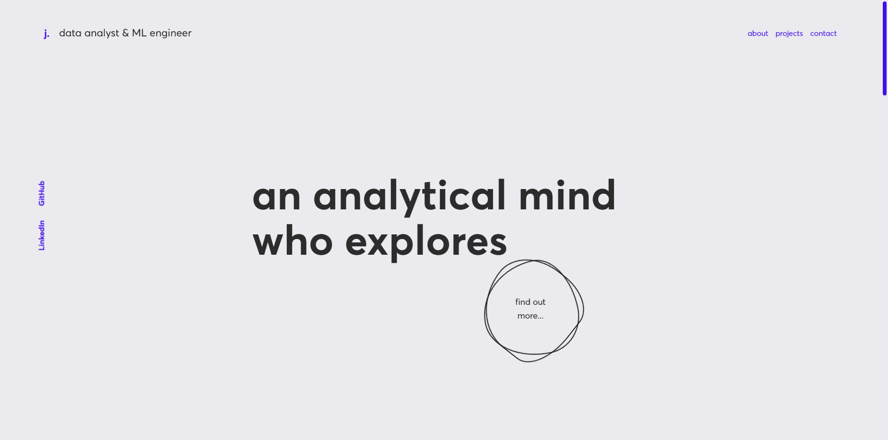

<h1 align="center">jhtkoo0426.github.io</h1>
<p align="center">This is the final iteration of my 2022 portfolio built with <a href="https://reactjs.org" target="_blank">React.js</a>.</p>
<p align="center">Previous iterations: <a href="https://github.com/jhtkoo0426/Portfolio-v1">v1</a></p>

    

<hr>



## Local Deployment
1. Navigate to the portfolio app directory
    ```
    cd app
    ```
2. Install and use the correct version of Node using <a href="https://github.com/nvm-sh/nvm">NVM</a>
    ```
    nvm install
    ```
3. Install all dependencies required
    ```
    npm install
    ```
4. Start the development server
    ```
    npm start
    ```

## Building and running for production
1. Navigate to the portfolio app directory
    ```
    cd app
    ```
2. Generate a full static production build which serves the webpage to github.io (no additional configuration needed)
    ```
    npm run deploy
    ```


## TODOs
- [x] Add more design variety to work showcases
- [x] Add scrolling effects
- [ ] CSS webkit
- [x] Add splash screen animation
- [x] Mobile responsiveness
- [x] Refactor code into React.js components, especially containers
- [x] Improve CSS code quality (potentially with SASS)


## Disclaimer/Copyright
The design of jhtkoo0426.github.io was inspired by these amazing web portfolios:
- [https://www.adriengervaix.com](https://www.adriengervaix.com)
- [https://qaisar.design](https://qaisar.design)